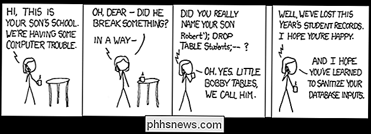

# Module 141

## Referential integrity



This repo contain our project for the module 141. It's the projetc of [divad1701](https://github.com/divad1701) and [Fonfon02](https://github.com/Fonfon02).

## Prerequisite
List of things to get before install:
  - A Mariadb server with root access
  ### [MariaDB installation](https://www.tecmint.com/connect-to-mysql-without-root-password/)
    ```bash
    # Update package index
    sudo apt update
    
    # Install MariaDB
    sudo apt install mariadb-server
    
    # Check if MariaDB is installed and running
    systemctl status mariadb
    
    # Run the sudo secure installation (not very useful in a lab like this one)
    sudo mysql_secure_installation
    ```
  - File [.my.cnf](https://www.tecmint.com/connect-to-mysql-without-root-password/) configured (in this tutorial we are going to use root account for scripts)
    Example of .my.cnf file
    ```bash
    [mysql]
    user=root
    password=yourpwd
  
    [mysqldump]
    user=root
    password=yourpwd
    ```
## Installation 

To install this project and use it you have to:
  - Clone or import as Zip this project on local
  - Decompress the project in this directory

## Content
This repo contain all the scripts asked for the Module 141. There's also database template files to do use the scripts

## ChangeLog
### Week 1 
  - Backup and restore a db
  - Backup and restore three dbs
  - Try blackhole and csv engine

### Week 2 
  - Creation of user
  - Give privileges to the user 
  - Test requests
  - Revoke access to the user
  - Crash the db with cross join

### Week 3 
  - Rework the README file
  - Write about referential integrity, foreign keys, etc...

### Week 4 
  - Install MariaDB
