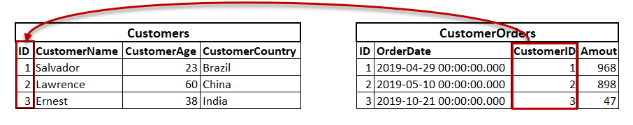

# Documentation

## Install MariaDB
```bash
# Update package index
sudo apt update

# Install MariaDB
sudo apt install mariadb-server

# Check if MariaDB is installed and running
systemctl status mariadb

# Run the sudo secure installation (not very useful in a lab like this one)
sudo mysql_secure_installation
```

## Install PostgreSql
```bash
# Update package index
sudo apt update

# Install packages
sudo apt install postgresql postgresql-contrib

# Test to login with postgres' user
sudo -i -u postgres
exit
```
If everything is fine, we can create a new user (or role)
```bash
# Create a new user on postgres
sudo -u postgres createuser --interactive
Enter name of role to add: test
Shall the new role be a superuser? (y/n) y

# Create a new user on your linux too
sudo adduser test

# Create a new database
sudo -u postgres createdb test # Use the same name for your db and for your user. By default a user will attempt to connect to a db who is called like him.

# Test your user and your db
sudo -i -u test
psql
psql -d postgres # Or you can specify a database to connect.
```

Links:
  - https://www.digitalocean.com/community/tutorials/how-to-install-postgresql-on-ubuntu-20-04-quickstart

## MariaDb vs MySql 

## PostgreSql vs MySql

## Phpmyadmin vs Adminer
### What are Phpmyadmin and Adminer?
They are both web administration tools for databases. They are used to manage databases, are written in PHP and can be installed on a server and accessed from a web browser.

They provide a GUI to manage databases.

### Comparison 
I will just compare the points I find (personally) important. I'll let you do your own research and your own opinion.

Phpmyadmin's Advantages:
  - More known and used than Adminer, it's easier to get help with it (with forums for example)
  - There are more possibilities to export databases (LaTex, MediaWiki Table, ...)

Adminer's Advantages:
  - Supports more databases types (MySql, SQLite, PostgreSql, MSSql, Oracle db)
  - The install is lighter than Phpmyadmin and is only found in a single file
  - No need to configure it, it'll just work

Links:
  - https://www.adminer.org/en/phpmyadmin/
    - !! Be careful about this link because that's a critic about adminer and phpmyadmin but made by the adminer devloppers.
  - https://www.wpoven.com/blog/adminer-vs-phpmyadmin/

## Referential integrity
Referential integrity is a state in which each information in a table A is linked to another in a table B. It allows the consistency of the database content.

To implement referential integrity, we use a foreign key. To create a foreign key between two tables, there are two conditions:

1. Both tables must work with the innoDB engine.
2. The fields used must be indexed and under the same data type.

Example:

In our database, we have a customer order from a customer. The referential integrity will prohibit to delete the customer as long as there is a customer order of this customer in the database. And in the same way, it will prohibit to create a customer order from this customer if it does not already exist in the database.



Links:
  - https://www.techrepublic.com/article/an-introduction-to-foreign-keys-and-referential-integrity-in-mysql/#:~:text=Referential%20integrity%20is%20an%20important,that%20make%20up%20the%20system.
  - https://fr.wikipedia.org/wiki/Intégrité_référentielle#:~:text=En%20informatique%2C%20et%20plus%20particulièrement,existe%20dans%20la%20table%20B.
  - https://www.sqlshack.com/wp-content/uploads/2020/02/foreign-key-data-matching-illustration.png

## Commands list
### Mysql useful commands
#### Change the engine's table or set it at the creation
~~~~sql
ALTER TABLE $TABLE ENGINE = CSV;
ALTER TABLE $TABLE ENGINE = BLACKHOLE;
CREATE TABLE test(i INT, c CHAR(10)) ENGINE = CSV;
CREATE TABLE test(i INT, c CHAR(10)) ENGINE = BLACKHOLE;
~~~~

#### Show infos about databases and tables
~~~~sql
SHOW DATABASES;
DROP DATABASE;
USE $DB;
SELECT * FROM $TABLE;
SHOW COLUMNS FROM $TABLE;
SHOW INDEX FROM $TABLE;
~~~~

#### Show infos about user
~~~~sql
SELECT User,Host FROM mysql.user;
SHOW GRANTS FOR '$USER'@'localhost';
~~~~

#### Transactions commands
~~~~sql
SET autocommit = ON;
SET autocommit = OFF;
~~~~

#### Get information schema infos
~~~~sql
SELECT TABLE_NAME, COLUMN_NAME FROM INFORMATION_SCHEMA.COLUMNS;
SHOW TABLE STATUS where name like '$TABLE';
SELECT TABLE_SCHEMA, TABLE_NAME, TABLE_COLLATION FROM INFORMATION_SCHEMA.TABLES WHERE TABLE_NAME = '$TABLE';
SELECT * FROM INFORMATION_SCHEMA.STATISTICS WHERE TABLE_NAME = '$TABLE';
~~~~

### Bash useful commands
```bash
mysql -e '$MYSQL_COMMAND'
mysqldump -u $USER -p $DB
mysqldump -u $USER -p $DB > $FILE.sql
```
